# hw1_introduction
ROS- Homework Assignment1

## Overview:
This readme file is for assignment 1 of Foundation of Robotics written by Harsh Panara - hp475@cornell.edu.


## Deliverables
Answer are in hw1_introduction/writeup/README.md.
<ol>
<li> Define in your own words what a node, topic, publisher, and subscriber are and how they relate to each other.</li>&nbsp

  
  Node: A node is basically a process which is responsible for performing computation in Robot Operating System. Each node is responsible and designed for some specific tasks which involves like collecting data from sensors, motors or some data processing. They communicate with each other by passing messages over topics. Nodes communicate indirectly through topics by using the publisher-subscriber model. Multiple nodes can publish to and subscribe from the same topic allowing for scalable and modular communication.
  
  Topic: Topic is communication channel which is being used by nodes to exchange some messages. It acts like a “message bus” where nodes can either send or receive information as well. Topics are having specific naming conventions and messages sent to that named topic are available to all nodes which are interested in that topic.
  
  Publisher: Publisher is a node that sends the message to a specific topic and Robot operating system communicates with Publisher subscriber communication. Publisher creates a stream of data that other nodes can even subscribe to. Example – A sensor node might publish data from a camera or a LiDAR sensor to a topic. 

  Subscriber: Subscriber is similar to publisher but they are the node that receives messages from a topic. It listens to data being published on a specified topic and processes that information. Example – A node controlling a robot arm might subscribe to topic like position coordinates and updates.

<li> What is the purpose of a launch file? </li> &nbsp

In ROS (Robot Operating System), a **launch file** is used to automate the process of starting multiple nodes and configuring various aspects of the system in just one go. A launch file has a `.launch` extension and is an XML file that defines which nodes should be executed, their parameters, and how they are interconnected.

### Benefits of Using Launch Files
- **Simplifies complex system management**: Reduces manual setup effort.
- **Reusability**: Allows reuse of the same configurations across different projects.
- **Modularity**: Enables organization and inclusion of other launch files for modular design.

### Key Purposes of Launch Files:
- **Start Multiple Nodes Simultaneously**: Launch several ROS nodes in one command.
- **Set Node Parameters**: Configure specific node parameters like sensor settings.
- **Namespace and Remapping**: Organize nodes and topics into namespaces and remap topics as needed.
- **Control Node Execution**: Manage node lifecycles (e.g., respawn on crash).
- **Include Other Launch Files**: Combine different launch files for better organization.

### Basic Syntax of a Launch File:
```xml
<launch> 
  <!-- Start the camera node --> 
  <node name="camera_node" pkg="camera_driver" type="camera_node" output="screen"> 
    <param name="resolution" value="640x480"/> 
  </node>
</launch>
```

<li> Include your RViz screenshot showing the car. </li>&nbsp

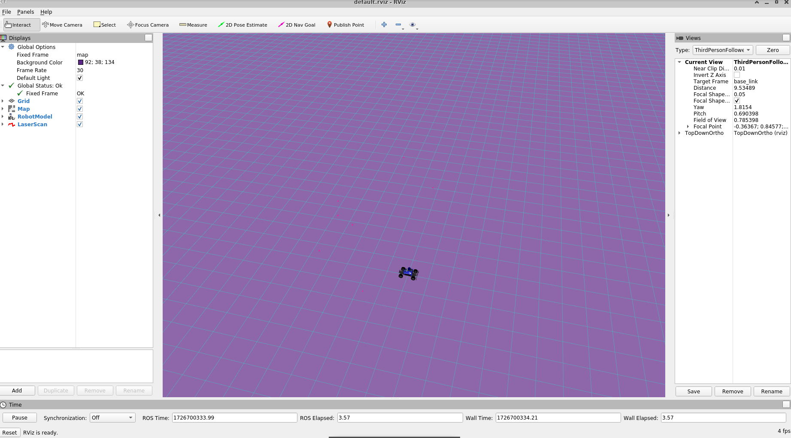

<li> Include your runtime_comparison.png figure for the different norm implementations. </li>&nbsp

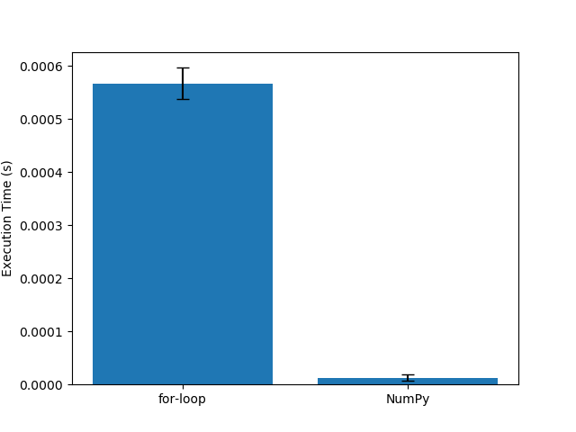

<li> Include the locations.png and norms.png figures for the plan figure_8.txt. Make sure the plots contain labelled axes and a title. </li>&nbsp

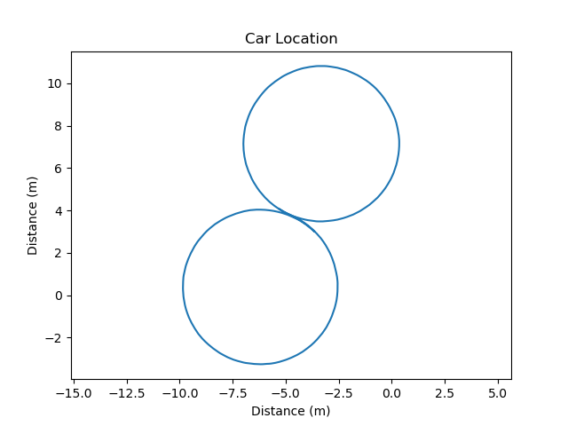

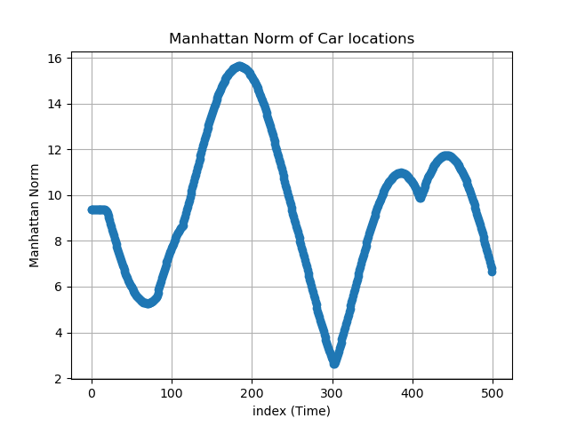

<li> Include the locations.png and norms.png figures for the plan crown.txt. Make sure the plots contain labelled axes and a title. </li>&nbsp

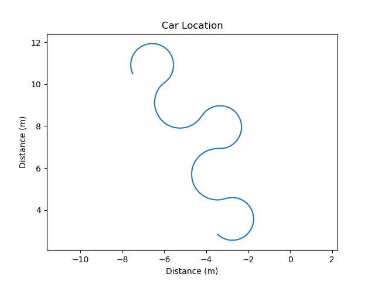

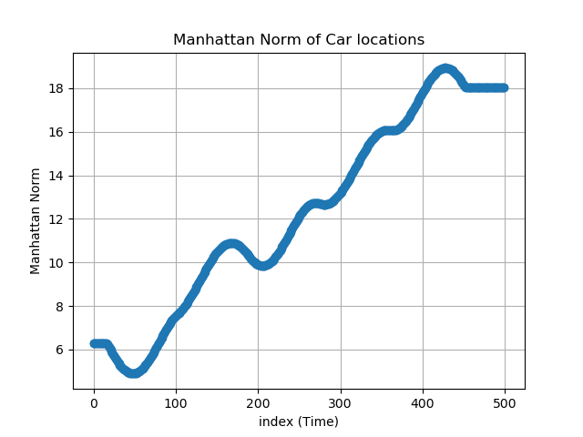

<li> Optional for undergrad, mandatory for graduate: Include your own plan file, any code you wrote to generate it, and the resulting locations.png figure. </li>&nbsp
I have tried to include 4 different path files and used a python code to generate the same. Generate_path.py file and path files are uploaded in the same directory. &nbsp
Every path have different images generated , Path1 has increasing steering angles and it starts at (0,0,0.0). Path2 starts at (2,2,0.785) with varying velocity and angles. Path3 starts at (-1,1,-0.785) with different velocities and angles. Path4 starts at (3,-3,1.5708) with a pattern of velocities and angles.&nbsp

### Images for Different Path

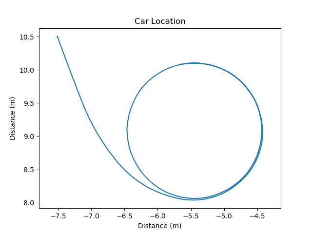
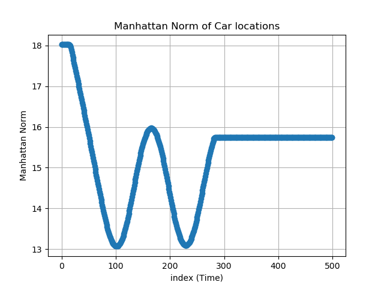
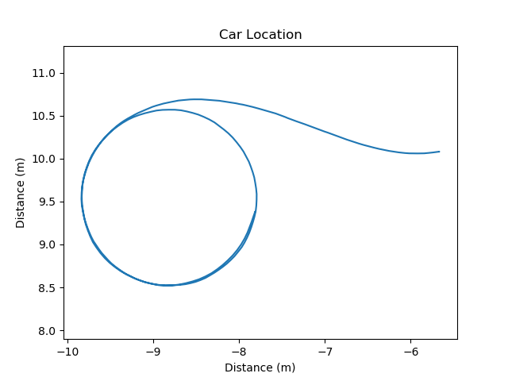
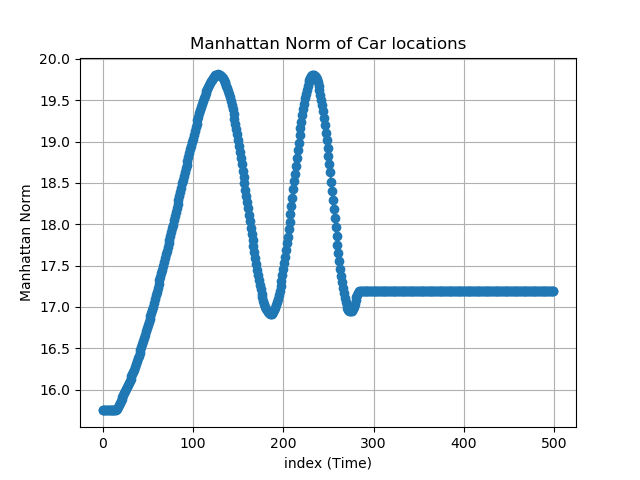
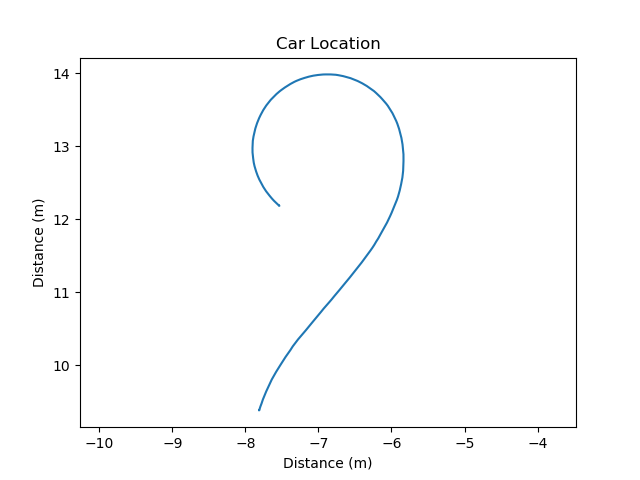
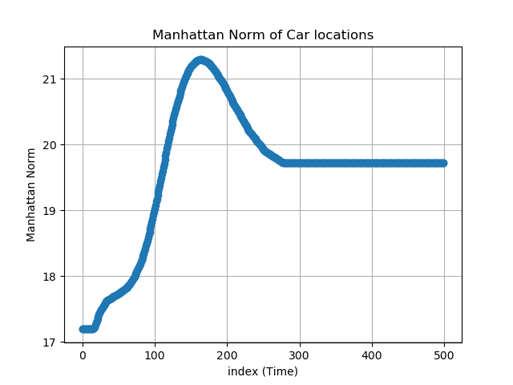
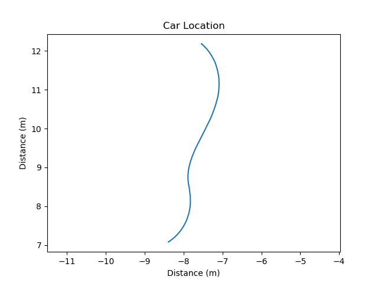
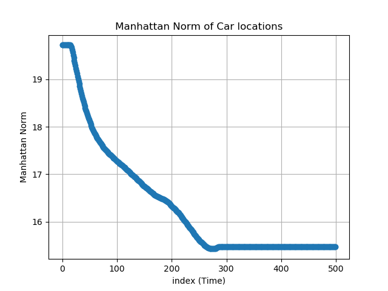


### Reference Images for Prime Test - Question 1

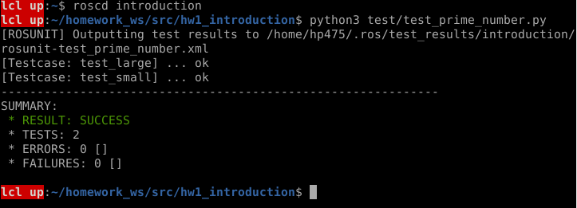
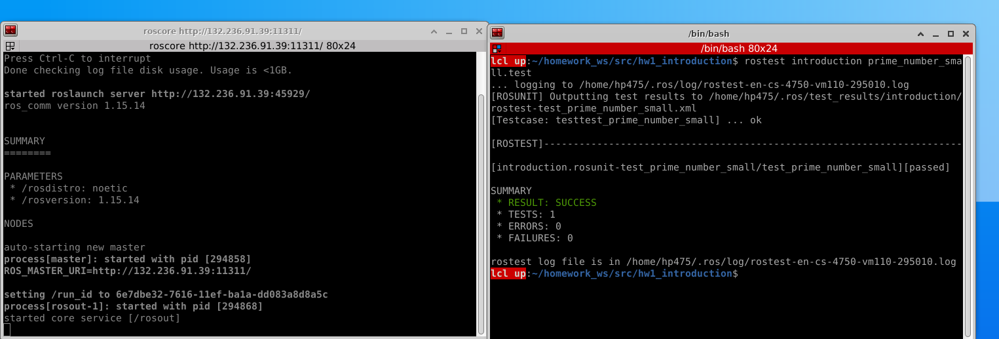
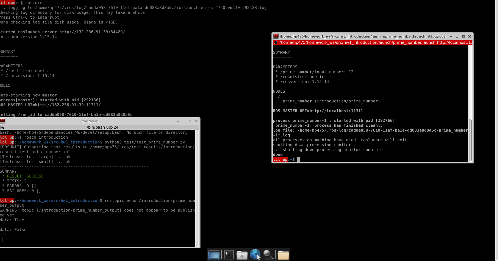

</ol>

### Submission 
hw1_introduction is submitted on Gradescope.


